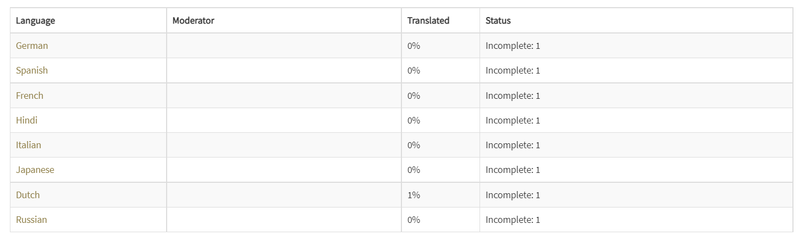
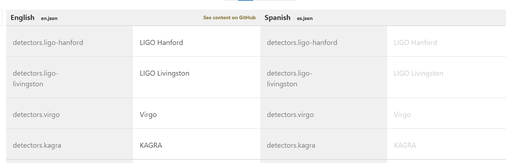
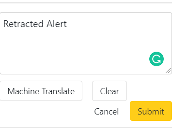
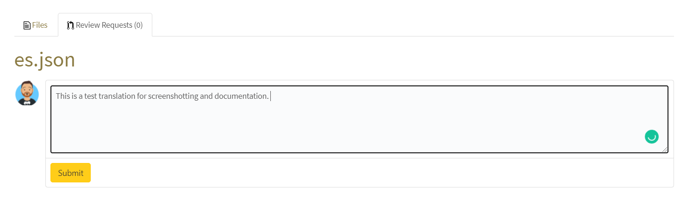

# Languages and localisation
To contribute to adding translations to Chirp we've decided to use gitlocalise to enable people to add translations. 

Everything is stored on the git https://github.com/sammorrell/chirp-translations 

## Getting started
Go to the link https://gitlocalize.com/repo/6185 and you'll be presented with a list of languages and the status of them. 

Click the language you wish to edit and click through to the en.json file. If you don't see the language you would like to translate please email please email sam[dot]cooper[AT]ligo[dot]org with the subject line "Chirp Language Request".  

Type on the right hand side of the box, screenshot included. 

The left hand side of the image is the English text to be translated, the right hand side is the translated text - note this will default to English if there's no translation. Click on the white box e.g. "LIGO Hanford" on the right hand side

Enter the translation - we'd prefer it if you didn't use machine translations as these could be inaccurate. Click submit once you've made a change and edit the other fields. 

Once this has been done you'll need to get an administrator or a moderator to review your request and make a pull request to the main branch.  

Add a comment to describe the translations that you've changed (just as you would for a git commit / merge request) and a moderator will review your translations. 

If you wish to become a moderator, please email sam[dot]cooper [AT]ligo[dot]org with the subject "Chirp Language moderator request" and I'll add you to the project. Anyone can contribute to the languages but we want to ensure that the translations are accurate and there is no malicoius intent in the translations. 

## FAQ
### What happens when we update the strings?
Git localise pulls the new strings and flags the new strings for translations, older strings that are not by the string change do not need to be re-translated. 

### I want to help translate but I can't see the language listed
Get in touch by emailing sam[dot]cooper[AT]ligo[dot]org with the subject line "Chirp Language Request" - this helps me sort though my inbox. 

### I think I should be a moderator
Great, we need moderators and translators - in general we're adding moderators that one of the developers knows or is in the LVK collaboration. If you want to become a moderator please email sam[dot]cooper[AT]ligo[dot]org with the subject "Chirp Language Moderator Request" and I'll reply to you and add you moderator status if appropriate. 

### I've spotted a mistake or typo in a translation
Oh no! Thanks for spotting the mistake, email with the subject line "Chirp Language Mistake" to sam[dot]cooper[AT]ligo[dot]org with the bit of text and the language that's affected - note we'll need the page on the app and the box it's near e.g. "about LIGO. 